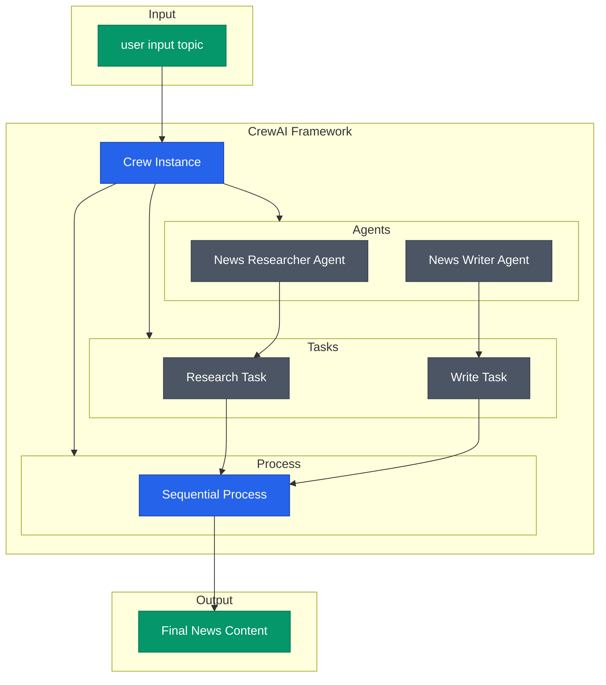

# NewsScribe AI

An intelligent content creation system that uses AI agents to research current events from the web and craft comprehensive news articles. Built with CrewAI, it specializes in producing detailed coverage of Input Topic through automated research and writing.

## Architecture

The system employs a two-stage process where specialized AI agents handle web research and content writing sequentially.



##  Features

- **Web Research Automation**: Gathers information from diverse online sources
- **Content Creation**: Transforms research findings into well-structured articles
- **Sequential Processing**: Ensures thorough research before writing begins
- **Topic Specialization**: Focused on global warfare and geopolitical news
- **Source Integration**: Combines information from multiple reliable sources

## Getting Started

### Prerequisites

```bash
pip install crewai
```

### Basic Usage

```python
from crewai import Crew, Process
from agents import news_researcher, news_writer
from tasks import research_task, write_task

# Initialize the crew
crew = Crew(
    agents=[news_researcher, news_writer],
    tasks=[research_task, write_task],
    process=Process.sequential,
)

# Execute the workflow
result = crew.kickoff(inputs={"topic": "Global Warfare & geopolitics"})
print(result)
```


##  Components

### Agents

1. **News Researcher Agent**
   - Scrapes and collects information from the web
   - Validates source credibility
   - Organizes research findings

2. **News Writer Agent**
   - Creates original content from research
   - Structures articles professionally
   - Maintains journalistic style

### Tasks

1. **Research Task**
   - Web scraping and data collection
   - Source verification
   - Information synthesis

2. **Write Task**
   - Content creation
   - Article structuring
   - Final formatting


##  Acknowledgments

- [CrewAI Framework](https://github.com/joaomdmoura/crewAI)
- Contributors and maintainers
- Open source community

##  Contact

Ankit Mishra - [@ankitmishralive](https://twitter.com/ankitmishralive)
